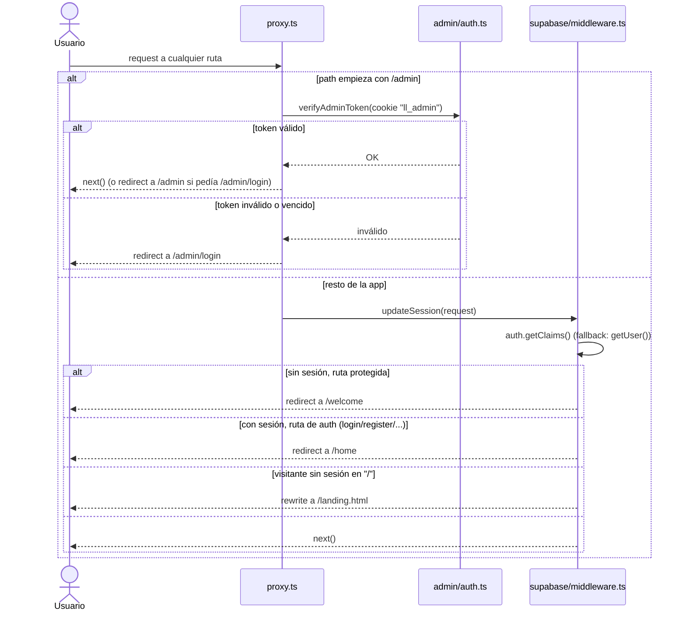
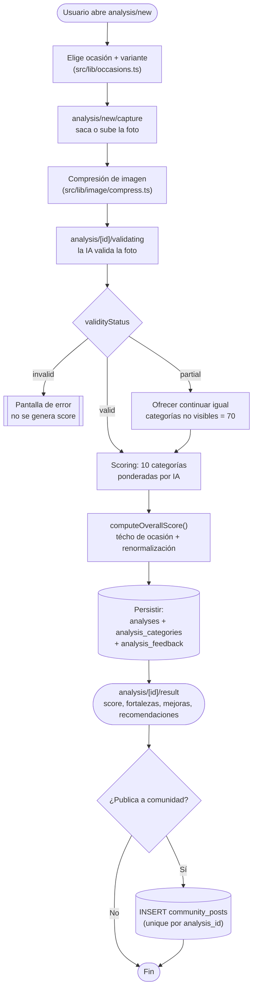

# Flujos principales

> **En resumen**: 4 flujos documentados con diagramas — auth (usuarios y admin, completamente separados), el flujo completo de análisis (foto → validación → scoring → resultado → publicación opcional), comunidad (feed con votos y comentarios) y gating de planes (hoy sin límites reales activos).

## Diagrama — routing de auth (`proxy.ts`)

`proxy.ts` es el único punto de entrada: decide primero si la request es de `/admin` o del resto de la app, y cada rama tiene su propia lógica de sesión (ver detalle en las dos secciones de abajo).

## Auth — usuarios normales {#auth-usuarios}

Gestionado por `src/lib/supabase/middleware.ts` (`updateSession()`), invocado desde `src/proxy.ts` para todo lo que no sea `/admin`.

- Rutas de auth: `/welcome, /register, /login, /forgot-password, /reset-password, /auth/callback`. Rutas públicas: `/legal, /landing.html`.
- Si faltan credenciales de Supabase (dev local), se saltea todo el manejo de auth (ver [02-architecture.md](./02-architecture.md#modo-demo-como-capa-de-fallback-completa)).
- Usa `supabase.auth.getClaims()` en vez de `getUser()`: verifica el JWT localmente si el proyecto tiene signing keys asimétricas habilitadas, evitando un round-trip de red al validar sesión — decisión de performance explícita porque el edge corre en São Paulo y Supabase en US East (~170ms medidos). Cae a `getUser()` si las signing keys no están habilitadas.
- Reglas de redirect:
  - Visitante sin sesión en `/` → rewrite (no redirect) a `/landing.html`, la URL sigue mostrando `/`.
  - Sin sesión, ruta que no es de auth ni pública → redirect a `/welcome`.
  - Con sesión, en una ruta de auth (login/register/etc.) → redirect a `/home`.
- Métricas: header `Server-Timing: auth;dur=<ms>` + log opcional bajo `PERF_LOG`.

## Auth — admin {#auth-admin}

Completamente desacoplada de Supabase Auth (`src/lib/admin/auth.ts`), resuelta en `src/proxy.ts` **antes** de que la request llegue a la lógica de usuarios (para que un admin sin sesión de usuario normal no termine redirigido a `/welcome`).

- Credenciales: `ADMIN_EMAIL` / `ADMIN_PASSWORD` (variables de entorno, no hay tabla de admins).
- Cookie `ll_admin`, 12hs de validez, payload `{exp}` en base64url firmado con HMAC-SHA256 (Web Crypto, no libs de Node — necesita correr en edge).
- Verificación: recalcula la firma esperada y compara con `safeEqual` (constante en tiempo, anti timing-attack); si el payload decodificado tiene `exp` vencido, inválido.
- `proxy.ts`: si el token es válido y pide `/admin/login`, redirige a `/admin`; si no es válido y la ruta no es `/admin/login` o `/admin/api/login`, redirige a `/admin/login`.

## Flujo de análisis de outfit

Diagrama de actividades del flujo completo, desde la elección de ocasión hasta la publicación opcional en comunidad:

Detalle paso a paso:

1. `analysis/new` — el usuario elige una de las 9 ocasiones (+ variantes de sub-contexto si aplica, ver `src/lib/occasions.ts`).
2. `analysis/new/capture` — captura de foto por cámara (client component), compresión previa a subir (`src/lib/image/compress.ts`).
3. `analysis/[id]/validating` — la IA valida que la foto sea un outfit legible (`ValidationResultSchema`: `valid | partial | invalid`).
4. Según el veredicto:
   - `invalid` → pantalla de error, no se genera score.
   - `partial` → foto parcial, se ofrece continuar igual (con categorías no visibles puntuadas neutro, 70).
   - `valid` → sigue a scoring.
5. `analysis/[id]/result` — muestra `overall_score`, desglose de las 10 categorías, fortalezas/mejoras/recomendaciones, badge cualitativo, botón de compartir. Persistido en `analyses` + `analysis_categories` + `analysis_feedback` (ver [04-data-model.md](./04-data-model.md)).
6. Opcionalmente el usuario publica el análisis a la comunidad (`community_posts`, `unique(analysis_id)` — un análisis solo puede tener un post).

Detalle del cálculo de score y del prompt en [06-scoring-engine.md](./06-scoring-engine.md).

## Flujo de comunidad

- Feed con dos tabs: **Popular** (ordena por `like_count desc`, empate por fecha desc) y **Reciente** (`posted_at desc`). Constante `FEED_PAGE_SIZE = 10`, paginado con `.range()`.
- Fuente: vista `community_feed_view` (posts + autor + datos del análisis + contadores precalculados).
- Un usuario tiene como máximo **una** reacción por post (`unique(post_id, user_id)` en `post_reactions`) — like y dislike son mutuamente excluyentes, no acumulables.
- Comentarios sin límite por post (`post_comments`, sin unique).
- Cada carga de feed hace una query adicional a `post_reactions` filtrada por el usuario logueado, para saber qué reaccionó él mismo (`myReactionByPost`), y resuelve signed URLs de las fotos.

## Flujo de gating (planes)

`canCreateAnalysis({planTier, currentMonthCount})` chequea contra `PLAN_LIMITS[planTier].monthlyAnalyses` (hoy `null` para ambos planes → siempre `true`). `historyCutoffDate(planTier)` calcula la fecha de corte del historial visible (hoy `null` para ambos → sin corte). Ver por qué están en `null` en [08-open-decisions.md](./08-open-decisions.md).
